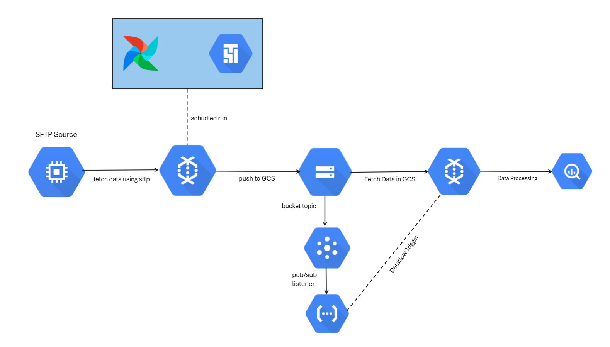

# GCP/SFTP

## Overview
This project builds a scalable and fully automated SFTP data pipeline using OSS and GCP services:

- Apache Airflow/Cloud Composer (Orchestration)

- Cloud Function (for event-based triggers)

Pub/Sub (Messaging system)

- Dataflow (Data processing and transforming)

- BigQuery (OLTP Database)

- GCS (Google's Object Storage System)

## Flow: Full Pipeline Explanation

1. SFTP Ingestion: Airflow start a scheduled trigger, The trigger launches a Dataflow Flex Template job designed to fetch data from an SFTP server and upload it to a GCS bucket.

2. Bucket Change Detection: Once the data is in GCS, a Pub/Sub topic listens for changes (new files or updates), then Cloud Function (or Airflow in newer setups) processes the Pub/Sub message and dynamically determines which Dataflow job to launch for data processing.

3. Database: The transformed data is saved back into GCS and BigQuery

